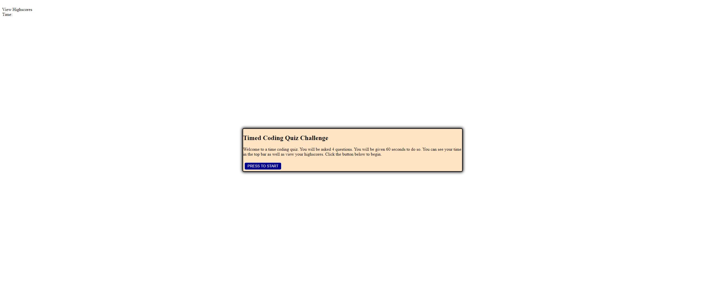

# <Your-Project-Title>

## Description
This website provides a chance for someone to test their knowledge on the subjects provided by the quiz. You can take it repeatedly and compare your scores on the high score list.
Provide a short description explaining the what, why, and how of your project. Use the following questions as a guide:

## Installation

visit the website via this url: https://alexanderbarlow.github.io/timed-quiz-challenge/
visit the GitHub repo via this url: https://github.com/AlexanderBarlow/timed-quiz-challenge

## Usage

To start the quiz click the start button. Then, as you answer each question you will be navigated to a different question. 

.png)

## Features

This website includes a highscore list which keeps track of your previous attempts through local storage. 
